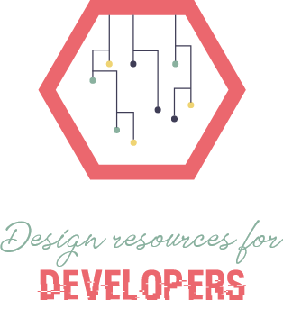

#  DR4Dev - Design resources for developers
  
Design resources for developers is a selection of more than 400 sites to facilitate developers.
A curated list of FREE design & UI resources for developers including stock photos, templates, frameworks, UI Kits, online tools and much much more.

  

## Category
 - Images
 - Videos
 - Tools
 - Project
 - Freebies
 - IDEs
 - Front-end
 - Icons
 - IDE Cloud
 - Langues
 - Style guide
 - Charges
 - Network
 - Study
 - Hosting
 - Pentest
 - Channels
 - Business
 - Fonts
 - Vector
 - Frameworks
 - UI
 - React
 - Vue
 - Angular
 - Svelte - 

## Firefox extension
Fast, offline and direct.

  

  

## TODO:
- [ ] Chrome Extension
- [ ] ApiClient
- [ ] More Categorys
- [ ] Insert Favorite Sites

### Impiration  
[OfficialMarinho/Links-uteis](https://github.com/OfficialMarinho/Links-uteis)
  
[bradtraversy/design-resources-for-developers](https://github.com/bradtraversy/design-resources-for-developers)

