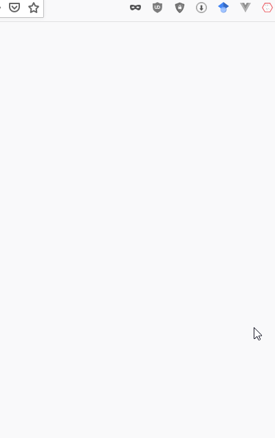
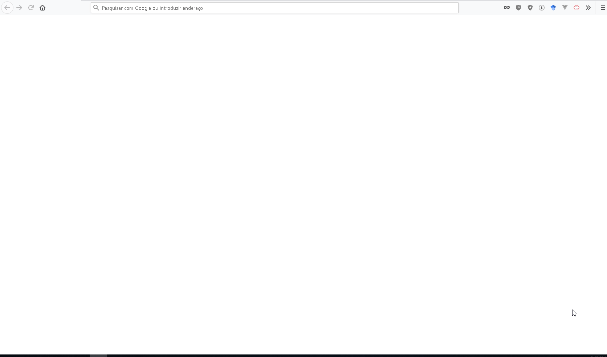

#  DR4Dev - Recursos de projeto para desenvolvedores
  
Os recursos de design para desenvolvedores são uma seleção de mais de 400 sites para facilitar os desenvolvedores.
Uma lista com curadoria de recursos de design gratuito e ui para desenvolvedores, incluindo fotos de ações, modelos, frameworks, Kits de UI, ferramentas online e muito mais.
  

  

  
## Categorias
 - Imagens
 - Videos
 - Ferramentas
 - Projeto
 - Freebies
 - IDEs
 - Front-end
 - Icones
 - IDE em Nuvem
 - Linguagem
 - Guia de Estilos
 - Ddesafios
 - Network
 - Estudos
 - Hospedagem
 - Pentest
 - Canais
 - Business
 - Fonts
 - Imagens Vetoriais
 - Frameworks
 - UI
 - React
 - Vue
 - Angular
 - Svelte
  
## Extensão para Firefox
Rápida, OffLine e direta.
  

  

  

  
## Por Fazer:
- [ ] Extensão para Chrome
- [ ] Api
- [ ] Mais categorias
- [ ] Inserir sistema de favoritos
  
### Inspiração  
[OfficialMarinho/Links-uteis](https://github.com/OfficialMarinho/Links-uteis)
  
[bradtraversy/design-resources-for-developers](https://github.com/bradtraversy/design-resources-for-developers)

