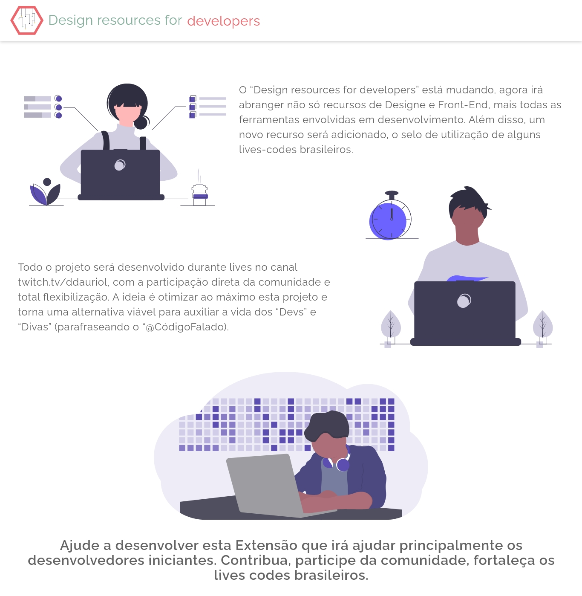
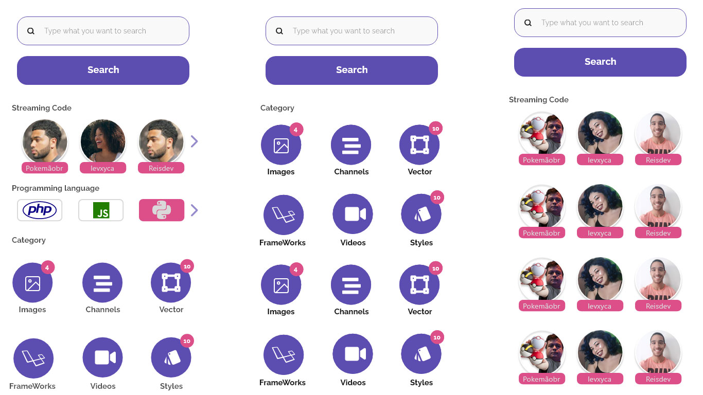

<p align="center">
  
</p>
  
#### O projeto seguirá inicialmente o seguinte cronograma:
 - [ ] Apresentação do Projeto.
 - [ ] Escolha do lay-out e cores da extenção.
 - [ ] Criação da API ( Python + FastAPI), conforme esquema pré definido do DB (MongoDB).
 - [ ] Desenvolvimento das funcionalidades para consumo da API utilizando JS.
 - [ ] Desenvolvimento do Front-End (exportação dos protótipos, criação dos estilos e implementação com HTML, CSS e JS).
 - [ ] Ajustes nos manifestos para utilização em Firefox, Chrome e Opera.
 - [ ] Publicar Beta e posteriormente submeter extensão.
  
#### Este projeto é aberto a contribuição da comunidade, além de ter seu código 100% disponível para uso.
Veja alguns streans que já apoiam o projeto:
 - [ ] CSOrlandi (Claudio Orlandi)
 - [ ] ReisDev
 - [ ] XDida
 - [ ] SpaceDevs (Marcus Pereira)
 - [ ] pachicodes
 - [ ] levxyca


#### Caso gostaria de ver seu Streaming favorito indicando algumas ferramentas que utilizam, fala com ele sobre o projeto, ele basicamente terá o trabalho de indicar a ferramenta e autorizar a listagem do seu canal da extensão.

*Atualmente, o bando de dados possui mais de 400 sites distribuídos nas seguintes categorias:*
```
Imagens, Videos, Ferramentas, Projeto, Freebies, IDEs, Front-end, Icones, IDE em Nuvem, Linguagem, Guia de Estilos, Ddesafios, Network, Estudos, Hospedagem, Pentest, Canais, Business, Fonts, Imagens Vetoriais, Frameworks, UI, React, Vue, Angular, Svelte
```
  
Já temos uma “issue” aberta para criar novas categorias e aumentar o banco de dados inicial.
  
*Participe das lives de desenvolvimento, durante as mesmas, um novo Logo será escolhido, assim como o nome oficial do projeto.*
  
#### Abaixo as teles previas do novo visual da extensão, assim vídeos da antiga extensão:
<p align="left">
  
</p>
  
<p align="left">
  
</p>

___
  
<p align="left">
  
</p>
  
  
#### Este projeto foi inspirado no antigo DR4Dev e nos repositórios abaixo.
[OfficialMarinho/Links-uteis](https://github.com/OfficialMarinho/Links-uteis)
[bradtraversy/design-resources-for-developers](https://github.com/bradtraversy/design-resources-for-developers)

